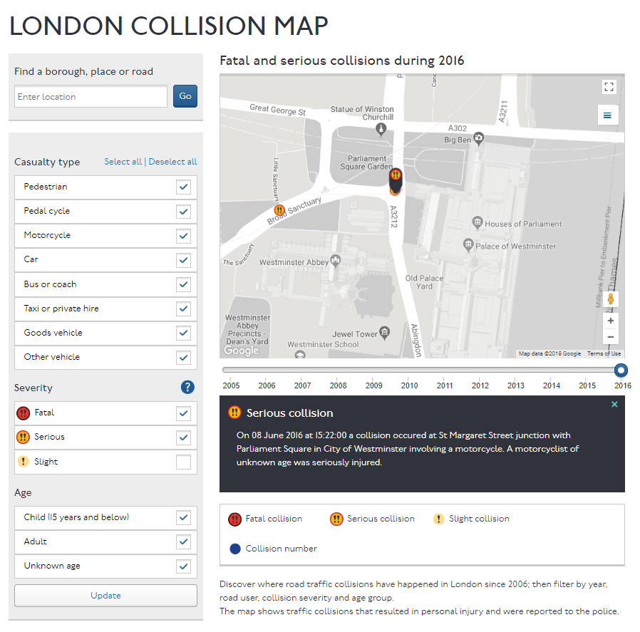

# Vision Zero Web Maps
This wiki page describes a collection of web maps of Vision Zero initiatives taken on by other cities around the world. The purpose of this wiki is to help identify what web map features we want to see in our own Vision Zero web map. Later, we may also add a collection of non-Vision Zero web maps that showcase features we are interested in.

The Vision Zero Network in the US has created a static map showing the participating US cities, which can be found [here](https://visionzeronetwork.org/resources/vision-zero-cities/). There also exists an interactive map of US cities and the stages/focuses of their road safety plans [here](https://batchgeo.com/map/028ae108ab7dbd212db3ab4eb6b4d204). Our description list below does not look into every one of those cities, but instead looks into the major players and their interesting or useful maps, as examples to consult for our own. 

DEKRA, a European vehicle inspection company, has also created an interactive map, [here](http://www.dekra-vision-zero.com/map/), that shows towns and cities with over 50,000 inhabitants in selected European countries, the USA and Japan that reported no deaths caused by road accidents in built-up (urban) areas in at least a single year in the period from 2009 to 2013. There are filters for population, year, continent, country, and the number of times the city has achieved Vision Zero for a year. 

## Vision Zero Maps by City

### Canada

#### Toronto

[Safety Measures & Mapping - City of Toronto](https://www.toronto.ca/services-payments/streets-parking-transportation/road-safety/vision-zero/safety-measures-and-mapping/)

- toggle safety measures
- toggle traffic collisions (fatalities, seriously injured)
- year filter
- toggle "related areas" such as schools and senior homes
- feature layer description available on info hover
- feature popup on click
- 3 different basemaps
- home extent
- scale
- list view of feature layers
- ESRI

#### Kingston
[Vision Zero: Fatality And Injury Collisions (2012 - 2016)](https://cityofkingston.maps.arcgis.com/apps/MapSeries/index.html?appid=fce2b0bce74340fe92d1175f9152874d)

- differentiates between fatals and injuries
- feature layer selection (and dynamic legend)
- clustered points, popups (no details)
- 3 different basemaps
- time slider
- search function
- home extent
- info box with descriptions of functionalities
- tabs for all collisions, peds, bikes, and motorcycles
- dynamic heatmap
- scale
- ESRI

#### Edmonton
[Collisions involving pedestrians and cyclists 2005-2015](https://www.pathsforpeople.org/map-collisions/)
 [FUTURE WALK/BIKE GRID](http://www.pathsforpeople.org/walk-bike-grid/)

Collisions
- clusters can be clicked through, but some error prevents access to individual collision marker and info
- can filter for peds or bikes and incident year
- counter for the number of incidents in the current map view
- choropleth layer showing percentage of people who commute by bike or walking
- Leaflet, map not made by the city

### United States

#### San Francisco
[Main page](http://visionzerosf.org/maps-data/)
 [VZ Priority Projects](https://sfgov.maps.arcgis.com/apps/webappviewer/index.html?id=13d93fa4bdc04bc3935a6e36139e27d9)
 [VZ High Injury Network 2017](https://sfgov.maps.arcgis.com/apps/webappviewer/index.html?id=fa37f1274b4446f1bdddd7bdf9e708ff)
 [VZ Fatality Reporting Map: 2014-2018](https://sfgov.maps.arcgis.com/apps/MapTools/index.html?appid=38d13e08cd74492ea674cdf27343370a)
 [TransBASE - all relevant layers](http://transbasesf.org/transbase/)
 [VZ Capital Improvement Projects](https://sfgov.maps.arcgis.com/apps/OnePane/basicviewer/index.html?appid=3650ae9a01f74cf886231901909b8d6c)
 [Vision Zero High Injury Network Map](https://sfgov.maps.arcgis.com/apps/OnePane/basicviewer/index.html?appid=335c508503374f5d94c95cb2a1f3f4f4)

- All ESRI, different variations and functionalities
- popups, info boxes
- no scales for all but 2
- road safety projects, infrastructure projects, etc.
- identified high injury network and intersections
- fatalities, no injury data at the same level as fatals, TransBASE has some detail by type of persons involved, by year
- search function

#### New York City

[Main page](https://www1.nyc.gov/site/visionzero/maps-data/maps-data.page)
 [Map](http://www.visionzeroview.nyc/)
 [Input Map](https://www1.nyc.gov/assets/visionzero/maps-data/vz-input-map.shtml) and the [Github for it](https://github.com/nycdot/nycdot-street-view-vision-zero)

Map
- filters for type of person, fatals, injuries, monthly or yearly
- time slider
- popups (no details)
- info box
- road safety projects, speed limits, outreach, and summary available as other tabs, not overlaid
- search functionality, including by borough
- heat map if injury, yearly, and zoomed out

Input Map
- search functionality
- descriptive legend on hover
- no popups or other data

#### Boston
[Main page](http://boston.maps.arcgis.com/apps/MapSeries/index.html?appid=4ac1feeeec084bfca74dc4413fd63abb)
 [Crashes Map](http://app01.cityofboston.gov/VisionZero/)
 [Reported Safety Concerns](http://app01.cityofboston.gov/VZSafety/)

Crashes Map
- based on the code of the NYC VZ View
- filters for type of person, fatals, injuries, monthly or yearly
- time slider
- popups (no details)
- info box
- no popups
- heat map if injury, yearly, and zoomed out

Reported Safety Concerns
- search functionality
- basemaps
- user location access
- ESRI?

Massachusetts also has a [fatalities map](http://www.visionzerocoalition.org/fatalities_map) for peds and bikes, made by Vision Zero Coalition. Google My Maps, each point shows name/date/community/time/age/latlong/news source.

#### Los Angeles

[LA VZ Map](http://visionzero.lacity.org/map/)
 [Resources - Vision Zero Los Angeles](http://visionzero.lacity.org/resources/)
 [High Injury Network](https://ladot.maps.arcgis.com/apps/MapJournal/index.html?appid=488062f00db44ef0a29bf481aa337cb3)

Map
- info box
- user location request
- search functionality
- routing
- filters for types of fatals, time range, and safety projects
- sharing functionality
- neighbourhood hover highlighting and zooming
- stats box
- point feature hover popup, click popup with description, loading of memorial page
- laggy
- no scale or home extent
- Google

HIN
- ESRI story
- shows safety plans and health and equity index for context
- final map did not load

#### Seattle

[Externally commissioned data visualization of collisions since 2006 in Seattle](http://seattlecollisions.timganter.io/), by Tim Ganter
 [Screen captures of the old official dashboard](http://sdotblog.seattle.gov/2016/06/10/new-vision-zero-dashboard-now-online/) that is no longer accessible

Tim Ganter Viz
- all the different stats, like economic costs, weather, road and lighting conditions, collision types and junction types
- filter by date range, district/neighbourhood, but cannot filter by type of collision
- points clustered with Leaflet

Old Dashboard
- dashboard showed collision stats, e.g. # of peds and bikes involved in collisions, VZ progress, collisions with KSI by age, mode of travel, contributing factors
- map showed collisions by year, and can filter by KSI and type of persons involved
- search functionality
- ESRI
- no scale
- popup with collision description on click

#### Bellevue
[Bellevue Vision Map](https://cobgis.maps.arcgis.com/apps/MapSeries/index.html?appid=8964b232b8ec4a0180e0b56b1c29071d)

- shows fatals and serious injuries, and can filter for peds/bikes/motorists
- cannot filter by time but can run time animator
- popup on click, limited information
- home extent, user location

#### San Jose

[Main page for maps](http://sanjoseca.gov/index.aspx?NID=5031)
 [FSI 2013-2017](https://csjdotgis.maps.arcgis.com/apps/webappviewer/index.html?id=ce7988594f2a4c509e19d07c5ad82521)
 [FSI 2012-2016](http://csjdotgis.maps.arcgis.com/apps/webappviewer/index.html?id=df3fef3152eb4415a06cdb24b2eeb69b)
 [FSI 2010-2015](http://csjdotgis.maps.arcgis.com/apps/webappviewer/index.html?id=b99756515f204648b16f3d3f1a1c2749)
 [VZ Safety Projects](https://csjdotgis.maps.arcgis.com/apps/webappviewer/index.html?id=d331bed1e63b4d3da08ba62f57c73d42)

FSIs
- ESRI
- info box with disclaimer
- toggle layers for fatals, SIs, safety corridors
- can query for date range and injured party
- time-based data animation
- different basemaps
- click features for popups with info
- search functionality
- home extent
- user location
- hideable attribute table
- heatmap for the FSI 2013-2017 map

Safety Projects
- ESRI
- toggle layers of different projects
- home extent
- user location
- time-based data animation

#### Austin
[2015 Fatality Map](http://www.visionzeroatx.org/austin-fatality-map/) by Vision Zero ATX, a not-for-profit
 [City of Austin VZ Input Map](http://austin.maps.arcgis.com/apps/webappviewer/index.html?id=fd3e3e7168fc4b3e9b43ff81f621ec34%20)

2015 Fatality Map
- Tableau
- can filter by many things, including gender, time of day, day of week, who controls the road, mode of transportation
- home extent
- can select data with mouse tools
- popup on click with fatality description
- search functionality
- share view functionality

City's Map
- ESRI
- info box, summary
- chart maker, user defined selection of data
- basemaps
- toggle layers of safety issues
- click popups with input
- search functionality
- hideable attribute table
- user location

#### Chicago
[Traffic Crashes Dashboard](https://data.cityofchicago.org/Transportation/Traffic-Crashes-Crashes-Dashboard/8tdq-a5dp)

Chicago does not appear to have a dedicated VZ map, but some digging turned up a Traffic Crashes Dashboard, created within the city's data portal. The dashboard has various charts and allows for the exporting of data, as well as API access, and has a broken map display.

#### Portland
[Portland Traffic Deaths and Injuries since 2006](https://pdx.maps.arcgis.com/apps/MapSeries/index.html?appid=47c2153a3fa84636bb63e25b451372d0)
 [PDF map of safety projects](https://www.portlandoregon.gov/transportation/article/658308)

- ESRI
- filter by mode of travel
- shows high crash corridors and intersections, but no filter
- home extent
- search functionality
- popups on click show description

#### Denver

[Denver Vision Zero](https://geospatialdenver.maps.arcgis.com/apps/MapJournal/index.html?appid=e333ca7679ec40c2a3ef449e3b111743)

As an ESRI story, this web map shows the multicriteria evaluation/analysis behind the creation of the Priority High Injury Network, which takes the HIN and applies different components of communities of concern to the analysis. Factors such as older adults, children and school areas, and socio-economics. 
- home extent
- search functionality
- popups on click with attribute information
- dynamic legend

#### Washington DC
[Main page](http://dcvisionzero.com/)
 [Safety Input Map](http://visionzero.ddot.dc.gov/VisionZero/)
 [Crashes map from data portal](http://opendata.dc.gov/datasets/crashes-in-dc)

Main page maps
- mapping of different aspects of Vision Zero
- a bit busted, many of the maps/layers don't load
- info bar on the side
- ESRI

Safety Input Map
- users can report hazardous locations and behaviours
- extensive legend and popup descriptions
- ESRI

Crashes map
- ESRI based data portal visualization
- attribute table with many fields
- related table with additional crash details

#### Alexandria
[High Crash Locations](https://www.alexandriava.gov/VisionZero#VisionZeroCrashDashboard)
 [VZ Dashboard](https://www.alexandriava.gov/performance/info/dashboard.aspx?id=101066)

HC Locations
- Tableau
- filter by priority location type e.g. KSI

Dashboard
- Tableau
- progress indicators charts
- map can filter by year, crash outcome
- popup on hover with crash info

#### Columbia

[Maps & Data - CoMo Vision Zero](http://www.comovisionzero.org/maps-data)

- can filter for driving/walking/biking
- filter for fatal or serious injury
- can display as heatmap
- can toggle layers for wards and road speeds
- time range filter
- Google map

#### Philadelphia

[Philadelphia Vision Zero](https://phl.maps.arcgis.com/apps/MapSeries/index.html?appid=30ef5a719bc54ee7863813fe1b0b684e)

- shows high injury network
- all crashes can be filtered for walking, biking, and people in vehicles
- tab for methodology
- crash info popup on click, shows age/gender/mode/year
- home extent

#### Montgomery County
[Serious and Fatal Collisions](https://data.montgomerycountymd.gov/Public-Safety/Serious-and-Fatal-Pedestrian-and-Cyclist-Collision/yszy-pfje)
 [Fatal Crashes](https://data.montgomerycountymd.gov/Public-Safety/Fatal-Crash-Map/fagt-fiez)
 [Pedestrian crash heat map](https://data.montgomerycountymd.gov/Public-Safety/Pedestrian-Crash-Heat-Map/5ix9-zgv8)

- not actually made for VZ, but are maps made from their Socrata data portal
- can filter for various crash attributes
- popup on hover
- attribute table visible
- dynamic heat map

### United Kingdom

#### London

[TfL Collisions Map](https://tfl.gov.uk/corporate/safety-and-security/road-safety/london-collision)

- fatal and serious and slight collisions
- can filter by casualty type, severity, age, and year
- description box on click
- search functionality
- cluster points, choropleth
- Google, streetview
- [comparing the NYC map to the TfL map](https://nyc.streetsblog.org/2016/07/27/behold-the-transport-for-london-traffic-collision-map/)

#### Edinburgh
[Main page](http://vision-zero-edinburgh-techresearch.hub.arcgis.com/), including static accidents hotspot map
 [High Injury Network v1](https://techresearch.maps.arcgis.com/apps/Cascade/index.html?appid=5e550eda39f8478ea9b99c4cd89b5f20)
 [High Injury Network v2](https://techresearch.maps.arcgis.com/apps/View/index.html?appid=c837797c745848e5ac25f41a954cb625)

HIN v1
- ESRI
- symbology highlighting road segments that have experienced accidents, popup shows number of accidents

#### Manchester
[Greater Manchester recorded road casualties 2005-2016 v1](https://stats.visionzeromcr.org.uk/)
 [Greater Manchester recorded road casualties 2005-2016 v2](https://fusiontables.googleusercontent.com/embedviz?q=select+col2+from+1hJIxNGosBhiYuPYAIpEJA1S6BrYLRDTlZssV9AHD&viz=MAP&h=false&lat=53.49523364278813&lng=-2.3330983747024447&t=1&z=11&l=col2&y=2&tmplt=2&hml=TWO_COL_LAT_LNG)
 [Greater Manchester recorded road casualties 2005-2016 by mode and severity](https://fusiontables.google.com/data?docid=1hJIxNGosBhiYuPYAIpEJA1S6BrYLRDTlZssV9AHD#map:id=3)

- first two links are about the same; showing collisinos symbolized by mode and severity
- popups with information about the collision, including streetview preview
- Google

- final map can toggle all the years, including differentialting between fatal, serious, or slight
- interactive map with popups showing collision info and streetview prveviews
- also tab for attribute table

